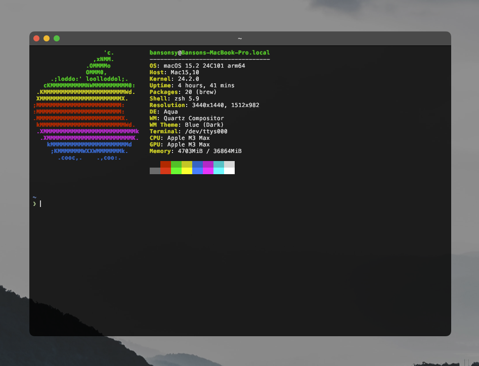

# My Dotfiles



### Requirements

- Have Homebrew installed.

```bash
/bin/bash -c "$(curl -fsSL https://raw.githubusercontent.com/Homebrew/install/HEAD/install.sh)"
```

- Install stow.

```zsh
brew install git stow starship fastfetch zsh-autosuggestions zsh-syntax-highlighting
brew install --cask kitty
```

- Git clone into $HOME directory.
- Stow respective packages.

```zsh
cd .dotfiles
```

```zsh
stow zsh
stow git
stow kitty
stow starship
stow fastfetch
```
